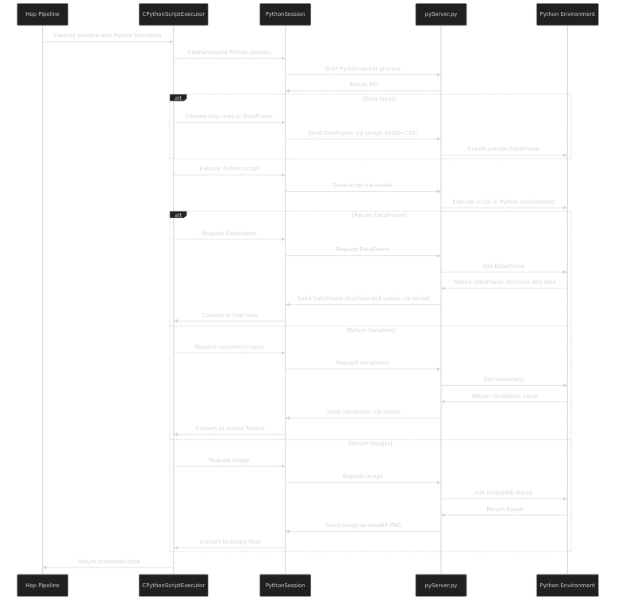

# CLAUDE.md

This file provides guidance to Claude Code (claude.ai/code) when working with code in this repository.

## Project Overview

The Hop CPython Plugin is an extension for Apache Hop that enables execution of Python scripts within Hop pipelines. It creates a bridge between Java and Python, allowing data scientists and engineers to leverage Python's data processing and machine learning capabilities within Hop's orchestration workflows.

## Build Commands

```bash
# Build the project
mvn clean install

# The build produces a plugin archive in target/hop-cpython-${version}.zip
# This archive can be extracted into your Hop plugin/transforms directory
```

## System Requirements

- Java 11+
- Apache Hop (current version: 2.7.0)
- Python 2.7+ or 3.x
- Python packages: pandas, numpy, scipy, matplotlib (Anaconda distribution recommended)

## Architecture

The plugin uses a client-server architecture:

1. **Java Client** (Hop transform): Initiates Python sessions and communicates with the Python server
   - Core classes: `CPythonScriptExecutor`, `CPythonScriptExecutorData`, `CPythonScriptExecutorMeta`, `PythonSession`
   
2. **Python Server**: A Python process started by the Java client
   - Main script: `pyServer.py` - Socket-based server that executes Python code and handles data conversion

Communication occurs via socket connections with data transmitted as JSON and CSV.

### Communication Flow Diagram

The following diagram illustrates the detailed communication flow between Hop and Python:



### Data Flow

1. Hop transforms send data to Python as pandas DataFrames
2. Python scripts process data using libraries like pandas, numpy, scikit-learn
3. Results are returned to Hop as:
   - DataFrames (converted to Hop rows)
   - Variables (as strings)
   - Images (as PNG binary data)

### Key Components

- **CPythonScriptExecutor**: Core transform implementation that manages Python process and data exchange
- **PythonSession**: Manages Python server lifecycle and communication
- **pyServer.py**: Socket server that runs Python code and exchanges data with Java

## Features

- Execute Python scripts within Hop pipelines
- Pass data as pandas DataFrames
- Return various Python objects (DataFrames, variables, images)
- Support for different processing modes (all rows, batch, row-by-row, reservoir sampling)
- Integration with data science libraries (pandas, numpy, scipy, matplotlib, scikit-learn)
- Support for visualizations through matplotlib
- **NEW in 2.13.0**: Apache Arrow support for high-performance data transfer
  - Automatic detection and use of Arrow when pyarrow is installed
  - Fallback to CSV format for compatibility
  - Configurable via transform settings

## Apache Arrow Integration

The plugin now supports Apache Arrow for data transfer, providing:
- **Performance**: Up to 10x faster data transfer for large datasets
- **Type Safety**: Better preservation of data types between Java and Python
- **Memory Efficiency**: Zero-copy data exchange reduces memory overhead
- **Compatibility**: Automatic fallback to CSV when Arrow is not available

### Requirements
- Apache Arrow Java 18.0.0 (included in plugin)
- pyarrow 15.0.0+ in Python environment (optional, for Arrow support)

### Configuration
Arrow support is enabled by default when pyarrow is available. It can be configured:
- In transform settings: "Use Arrow for data transfer" checkbox
- Programmatically: `session.setUseArrow(boolean)`